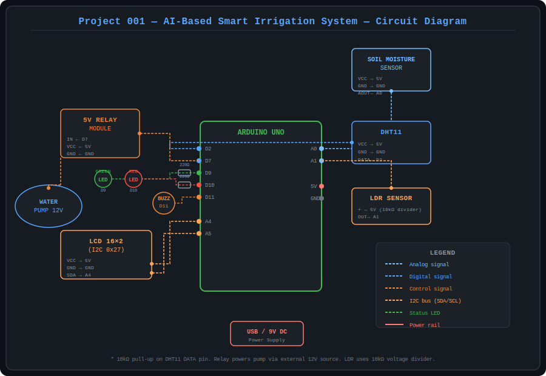

# 🌱 Project 001 — AI-Based Smart Irrigation System
### Arduino Uno + Soil Analytics

[](https://arduino.cc)
[](../../LICENSE)
[]()

> Intelligent irrigation controller using fuzzy-logic AI to decide when to water crops based on real-time soil moisture, temperature, humidity, and sunlight data.

---

## 📸 System Preview

| Circuit Diagram | Serial Dashboard |
|:-:|:-:|
|  | See `ArduinoCode/serial_dashboard.py` |

---

## ⚡ Quick Start

```bash
# 1. Open in Arduino IDE
ArduinoCode/SmartIrrigation.ino

# 2. Install libraries
#    Adafruit DHT sensor library
#    LiquidCrystal_I2C by Frank de Brabander

# 3. Calibrate moisture sensor (see Documentation)
#    Set SOIL_DRY_VALUE and SOIL_WET_VALUE

# 4. Upload to Arduino Uno

# 5. (Optional) Run Python live dashboard
pip install pyserial matplotlib
python ArduinoCode/serial_dashboard.py --port COM3
```

---

## 📁 Project Structure

```
001_AI-Based_Smart_Irrigation_System/
│
├── ArduinoCode/
│   ├── SmartIrrigation.ino      ← MAIN SKETCH (upload this)
│   └── serial_dashboard.py      ← Python live dashboard
│
├── CircuitDiagram/
│   └── circuit_diagram.svg      ← Wiring diagram
│
├── Components/
│   └── components_list.txt      ← Full Bill of Materials
│
├── Documentation/
│   └── PROJECT_DOCUMENTATION.md ← Full setup guide
│
├── Images/
│   └── system_overview.svg      ← System architecture diagram
│
└── README.md                    ← This file
```

---

## 🔌 Pin Mapping

| Component | Arduino Pin |
|-----------|-------------|
| Soil Moisture Sensor (AOUT) | A0 |
| DHT11 (DATA) | D2 |
| LDR | A1 |
| Relay IN | D7 |
| Green LED | D9 |
| Red LED | D10 |
| Buzzer | D11 |
| LCD SDA | A4 |
| LCD SCL | A5 |

---

## 🤖 AI Decision Logic

The fuzzy-logic engine considers 4 inputs simultaneously:

```
Dry soil (< 30%) + Daytime → ✅ Irrigate
Wet soil (> 70%)            → ❌ Skip  
Night-time                  → ❌ Skip
Hot + dry conditions        → ✅ Irrigate
```

---

## 🛒 Cost

| Platform | Estimated Cost |
|----------|---------------|
| India    | ₹600 – ₹900   |
| USD      | $8 – $12      |

---

## 📚 Part of Arduino Uno 100 Projects Series

| ← Prev | Current | Next → |
|--------|---------|--------|
| — | **001 Smart Irrigation** | [002 Predictive Maintenance](../002_Industrial_Predictive_Maintenance_System_using_Vibration_Analysis) |
