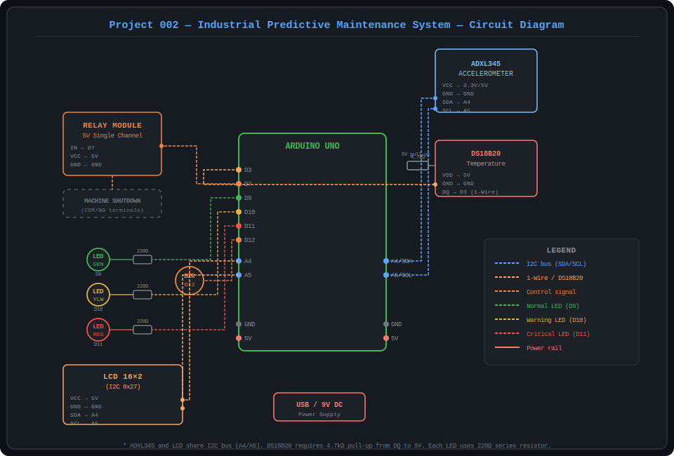
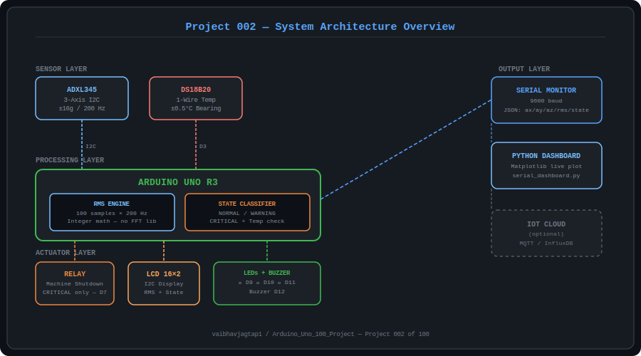

# 🏭 Project 002 — Industrial Predictive Maintenance System
### Arduino Uno + Vibration Analysis

[](https://arduino.cc)
[](../../LICENSE)
[]()

> Real-time machine health monitoring using an ADXL345 3-axis accelerometer and DS18B20 temperature sensor. Computes RMS vibration magnitude at 200 Hz to classify machine state as NORMAL, WARNING, or CRITICAL — and triggers an emergency relay shutdown before catastrophic failure.

---

## 📸 System Preview

| Circuit Diagram | System Architecture |
|:-:|:-:|
|  |  |

---

## ⚡ Quick Start

```bash
# 1. Open in Arduino IDE
ArduinoCode/PredictiveMaintenance.ino

# 2. Install libraries (via Library Manager)
#    Adafruit ADXL345
#    Adafruit Unified Sensor
#    LiquidCrystal_I2C by Frank de Brabander
#    OneWire by Paul Stoffregen
#    DallasTemperature by Miles Burton

# 3. Set RMS thresholds for your machine baseline (see Documentation)
#    #define WARNING_THRESHOLD   3.0f
#    #define CRITICAL_THRESHOLD  7.0f

# 4. Upload to Arduino Uno

# 5. (Optional) Run Python live dashboard
pip install pyserial matplotlib
python ArduinoCode/serial_dashboard.py --port COM3
```

---

## 📁 Project Structure

```
002_Industrial_Predictive_Maintenance_System_using_Vibration_Analysis/
│
├── ArduinoCode/
│   ├── PredictiveMaintenance.ino  ← MAIN SKETCH (upload this)
│   └── serial_dashboard.py        ← Python live 4-panel dashboard
│
├── CircuitDiagram/
│   └── circuit.svg                ← Full wiring diagram
│
├── Components/
│   └── components_list.txt        ← Full Bill of Materials with costs
│
├── Documentation/
│   └── PROJECT_DOCUMENTATION.md   ← Full setup & calibration guide
│
├── Images/
│   └── system_overview.svg        ← System architecture block diagram
│
└── README.md                      ← This file
```

---

## 🔌 Pin Mapping

| Component | Arduino Pin | Protocol |
|-----------|-------------|----------|
| ADXL345 SDA | A4 | I2C |
| ADXL345 SCL | A5 | I2C |
| DS18B20 DQ  | D3 | 1-Wire (+ 4.7kΩ pull-up) |
| Relay IN    | D7 | Digital OUT |
| LED Green   | D9 | Digital OUT |
| LED Yellow  | D10 | Digital OUT |
| LED Red     | D11 | Digital OUT |
| Buzzer      | D12 | PWM (tone) |
| LCD SDA     | A4 | I2C (shared bus) |
| LCD SCL     | A5 | I2C (shared bus) |

---

## 🚦 Fault Detection States

| State | RMS Threshold | Temperature | LED | Buzzer | Relay |
|-------|--------------|-------------|-----|--------|-------|
| ✅ NORMAL | < 3.0 m/s² | < 80°C | 🟢 Green (D9) | Silent | OFF |
| ⚠️ WARNING | 3.0 – 7.0 m/s² | 80–100°C | 🟡 Yellow (D10) | Single beep | OFF |
| 🚨 CRITICAL | ≥ 7.0 m/s² | > 100°C | 🔴 Red (D11) | Rapid alarm | **ON** (shutdown) |

> Thresholds are adjustable via `WARNING_THRESHOLD` and `CRITICAL_THRESHOLD` defines. See calibration guide in Documentation.

---

## 📊 RMS Algorithm

```
RMS = √( (1/N) × Σ (ax² + ay² + az²) )
```

- **N = 100 samples** collected at **200 Hz** (one 500 ms window)
- Uses **integer accumulation** (×1000 scaling) — no float per-sample, no FFT library required
- Bearing temperature escalates state independently of vibration RMS

---

## 🛒 Cost

| Platform | Estimated Cost |
|----------|---------------|
| India    | ₹1,169 – ₹1,350 |
| USD      | $14 – $18     |

---

## 📚 Part of Arduino Uno 100 Projects Series

| ← Prev | Current | Next → |
|--------|---------|--------|
| [001 Smart Irrigation](../001_AI-Based_Smart_Irrigation_System_using_Arduino_and_Soil_Analytics) | **002 Predictive Maintenance** | [003 Blood Glucose Monitor](../003_Non-Invasive_Blood_Glucose_Monitoring_Device_using_NIR_Spectroscopy) |
