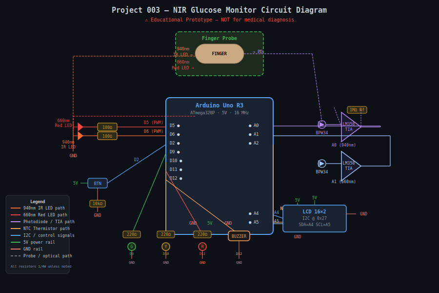
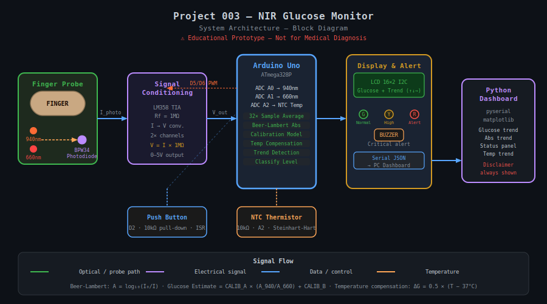

# 🩸 Project 003 — Non-Invasive Blood Glucose Monitoring Device using NIR Spectroscopy
### Arduino Uno + Near-Infrared Spectroscopy

[](https://arduino.cc)
[](../../LICENSE)
[]()
[]()

---

## ⚠️ Medical Disclaimer

> **THIS IS AN EDUCATIONAL PROTOTYPE ONLY.**
>
> This device is **NOT a certified medical device** and **MUST NOT** be used for
> clinical blood glucose diagnosis, treatment decisions, or any medical purpose.
> The glucose readings produced by this prototype are not clinically validated.
>
> **For actual blood glucose monitoring, always use an FDA/CE-cleared glucometer.**

---

> Demonstrates Beer-Lambert law and NIR spectroscopy on Arduino Uno.
> A 940 nm IR LED + 660 nm red LED illuminate a finger probe. A BPW34 photodiode
> with LM358 TIA amplifier feeds two ADC channels. Signal averaging, ratio-metric
> absorbance calculation, and a linear calibration model estimate relative glucose
> concentration with LCD display, trend arrows, and colour-coded LED/buzzer alerts.

---

## 📸 System Preview

| Circuit Diagram | System Architecture |
|:-:|:-:|
|  |  |

---

## ⚡ Quick Start

```bash
# 1. Open in Arduino IDE
ArduinoCode/GlucoseMonitor.ino

# 2. Install libraries (via Library Manager)
#    LiquidCrystal_I2C by Frank de Brabander

# 3. Upload to Arduino Uno (9600 baud)

# 4. Build finger probe (see Documentation/PROJECT_DOCUMENTATION.md §5.3)
#    Black cardboard U-clip, LED one side, photodiode other side

# 5. Press button on D2 → measurement begins
#    Keep finger still until LCD shows result

# 6. (Optional) Run Python live dashboard
pip install pyserial matplotlib
python ArduinoCode/serial_dashboard.py --port COM3
```

---

## 📁 Project Structure

```
003_Non-Invasive_Blood_Glucose_Monitoring_Device_using_NIR_Spectroscopy/
│
├── ArduinoCode/
│   ├── GlucoseMonitor.ino       ← MAIN SKETCH (upload this)
│   └── serial_dashboard.py      ← Python live dashboard
│
├── CircuitDiagram/
│   └── circuit.svg              ← Full wiring schematic
│
├── Components/
│   └── components_list.txt      ← Bill of Materials (BOM)
│
├── Documentation/
│   └── PROJECT_DOCUMENTATION.md ← Full technical guide
│
├── Images/
│   └── system_overview.svg      ← System architecture block diagram
│
└── README.md                    ← This file
```

---

## 🔌 Pin Mapping

| Component | Arduino Pin | Notes |
|-----------|------------|-------|
| 940 nm IR LED (PWM) | D6 | 100 Ω series resistor |
| 660 nm Red LED (PWM) | D5 | 100 Ω series resistor (reference channel) |
| Photodiode TIA output (940 nm) | A0 | LM358 + 1 MΩ feedback |
| Photodiode TIA output (660 nm) | A1 | LM358 + 1 MΩ feedback |
| NTC Thermistor voltage divider | A2 | 10 kΩ series resistor |
| Measurement trigger button | D2 | 10 kΩ pull-down, hardware ISR |
| Green LED (NORMAL) | D9 | 220 Ω resistor |
| Yellow LED (BORDERLINE/HIGH) | D10 | 220 Ω resistor |
| Red LED (ALERT) | D11 | 220 Ω resistor |
| Buzzer (active) | D12 | Critical alerts |
| LCD 16×2 I2C SDA | A4 | PCF8574 @ 0x27 |
| LCD 16×2 I2C SCL | A5 | PCF8574 @ 0x27 |

---

## 🩸 Glucose Status Levels

| Status | Range (mg/dL) | Indicator | Action |
|--------|-------------|-----------|--------|
| **LOW** | < 70 | 🔴 Red LED + Buzzer | Critical — seek medical attention |
| **NORMAL** | 70 – 140 | 🟢 Green LED | Within normal fasting range |
| **HIGH** | 140 – 200 | 🟡 Yellow LED | Elevated — monitor closely |
| **VERY HIGH** | > 200 | 🔴 Red LED + Buzzer | Critical — seek medical attention |

> These thresholds are for educational reference only and do not constitute medical advice.

---

## 📡 Serial JSON Output

```json
{
  "nir": 412.5,
  "red": 387.2,
  "abs940": 0.3953,
  "abs660": 0.4218,
  "absorbance": 0.9373,
  "glucose": 102.5,
  "status": "NORMAL",
  "temp": 36.8
}
```

| Field | Description |
|-------|-------------|
| `nir` | Raw ADC average for 940 nm channel |
| `red` | Raw ADC average for 660 nm channel |
| `abs940` | Absorbance at 940 nm: log₁₀(1023/I_940) |
| `abs660` | Absorbance at 660 nm: log₁₀(1023/I_660) |
| `absorbance` | Ratio: abs940 / abs660 |
| `glucose` | Estimated glucose in mg/dL |
| `status` | Classification string |
| `temp` | Finger temperature in °C |

---

## 🔬 How It Works (Beer-Lambert Law)

```
Absorbance = log₁₀(I₀ / I)    where I₀ = incident, I = transmitted

A ∝ concentration × path_length

Ratio R = A_940nm / A_660nm    (cancels path-length variability)

Glucose (mg/dL) = CALIB_A × R + CALIB_B  (linear regression model)
```

Temperature compensation: `ΔG = 0.5 × (T_finger − 37°C)`

---

## 🛒 Cost

| Platform | Estimated Cost |
|----------|---------------|
| India (INR) | ₹900 – ₹1,400 |
| International (USD) | $12 – $18 |

> Costs based on common electronics retailers as of 2025.
> Excludes optional upgrade components (AS7263, MAX30102, Bluetooth).

---

## 📚 Part of Arduino Uno 100 Projects Series

| ← Prev | Current | Next → |
|--------|---------|--------|
| [002 Predictive Maintenance](../002_Industrial_Predictive_Maintenance_System_using_Vibration_Analysis) | **003 NIR Glucose Monitor** | [004 Line-Following Robot](../004_Autonomous_Line-Following_Robot_with_Obstacle_Avoidance_and_PID_Control) |
