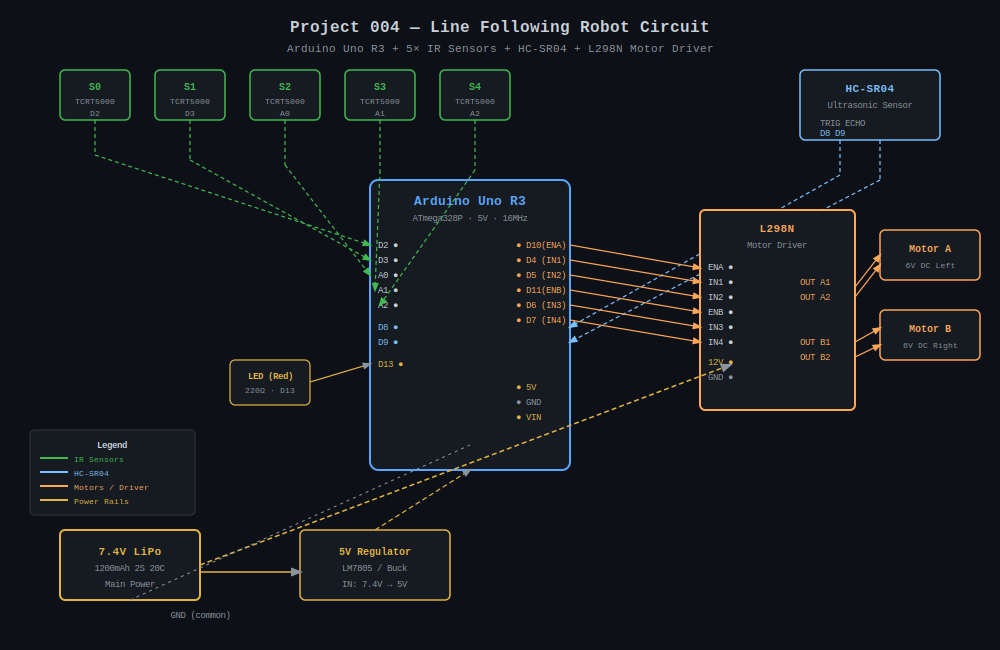
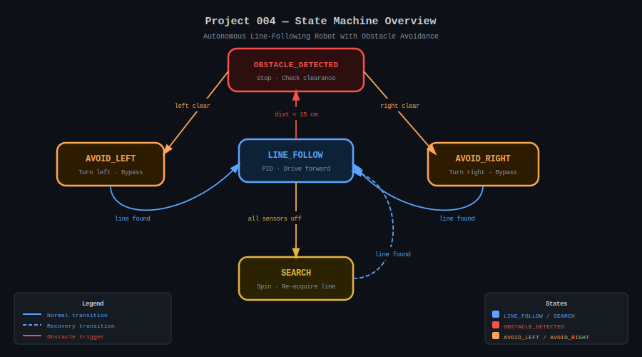

# 🤖 Project 004 — Autonomous Line-Following Robot
### Arduino Uno + PID Control + Obstacle Avoidance

[](https://arduino.cc)
[](../../LICENSE)
[]()
[]()

A 2-wheel-drive robot that autonomously follows a black line using **5 TCRT5000 IR sensors** and
a **PID controller** for smooth, accurate steering.  An **HC-SR04 ultrasonic sensor** detects
obstacles ahead and a **state machine** manoeuvres around them before returning to line-following.

---

## System Preview

| Circuit Diagram | State Machine |
|:---:|:---:|
|  |  |

---

## ⚡ Quick Start

```bash
# 1. Open the sketch in Arduino IDE
#    File → Open → ArduinoCode/LineFollowingRobot.ino

# 2. Select Board: Arduino Uno  |  Port: your COM/ttyUSB

# 3. Upload (Ctrl+U)

# 4. Launch live dashboard
pip install pyserial matplotlib
python ArduinoCode/serial_dashboard.py --port /dev/ttyUSB0 --baud 9600
```

---

## 📁 Project Structure

```
004_Autonomous_Line-Following_Robot_with_Obstacle_Avoidance_and_PID_Control/
├── ArduinoCode/
│   ├── LineFollowingRobot.ino   ← Main sketch (PID + state machine)
│   └── serial_dashboard.py     ← Python live dashboard
├── CircuitDiagram/
│   └── circuit.svg              ← Full wiring diagram (dark theme)
├── Components/
│   └── components_list.txt      ← Bill of materials
├── Documentation/
│   └── PROJECT_DOCUMENTATION.md ← Full technical documentation
├── Images/
│   └── system_overview.svg      ← State machine diagram
├── Datasheets/                  ← (component datasheets)
└── README.md
```

---

## 🔌 Pin Mapping

| Pin | Label | Connected To |
|-----|-------|-------------|
| D2 | S0 | IR Sensor far-left (TCRT5000) |
| D3 | S1 | IR Sensor left |
| A0 | S2 | IR Sensor center |
| A1 | S3 | IR Sensor right |
| A2 | S4 | IR Sensor far-right |
| D8 | TRIG | HC-SR04 Trigger |
| D9 | ECHO | HC-SR04 Echo |
| D10 (PWM) | ENA | L298N Left motor speed |
| D4 | IN1 | L298N Left motor direction A |
| D5 | IN2 | L298N Left motor direction B |
| D11 (PWM) | ENB | L298N Right motor speed |
| D6 | IN3 | L298N Right motor direction A |
| D7 | IN4 | L298N Right motor direction B |
| D13 | LED | Status / obstacle indicator LED |
| 5V | — | Sensor VCC, HC-SR04 VCC |
| GND | — | Common ground |

---

## 🔄 State Machine

| State | Trigger Condition | Robot Action |
|-------|-------------------|-------------|
| `LINE_FOLLOW` | Default / line re-acquired | PID correction, drive forward |
| `OBSTACLE_DETECTED` | `dist < 15 cm` | Stop, check left/right clearance |
| `AVOID_LEFT` | Left side clearer | Turn left, drive past, turn right |
| `AVOID_RIGHT` | Right side clearer | Turn right, drive past, turn left |
| `SEARCH` | All 5 sensors off line | Spin toward last-known error direction |

---

## 🎛️ PID Parameters

| Constant | Default Value | Effect |
|----------|:---:|--------|
| `KP` | `0.4` | Proportional — speed of response |
| `KI` | `0.01` | Integral — removes steady-state drift |
| `KD` | `0.3` | Derivative — damps oscillation |
| `BASE_SPEED` | `150` | Normal cruising PWM (0–255) |
| `MAX_SPEED` | `200` | Maximum PWM clamp |
| `OBSTACLE_DIST_CM` | `15` | Avoidance trigger distance (cm) |

Tuning tip: set Ki=0, Kd=0 first; increase Kp until tracking is accurate but just beginning to oscillate; then add Kd to smooth it; add tiny Ki only to remove long-term drift.

---

## 📦 Components & Cost

| | India | USD |
|---|---|---|
| **Estimated Total** | ₹1,500 – ₹2,200 | $20 – $30 |

Key components: Arduino Uno R3 · 5× TCRT5000 IR sensors · HC-SR04 · L298N motor driver ·
2× 6V geared motors · 7.4V LiPo battery · 2WD chassis.

See [`Components/components_list.txt`](Components/components_list.txt) for the full BOM.

---

## 📊 Serial Telemetry Format

The Arduino outputs a JSON packet every 100 ms:

```json
{"sensors":[0,1,1,0,0],"pos":-0.50,"error":-0.50,"pid_out":-6.20,"left_spd":143,"right_spd":156,"state":"LINE_FOLLOW","dist":87.4}
```

---

## 📖 Documentation

Full technical documentation including circuit wiring guide, PID tuning procedure,
troubleshooting table, and future enhancements:
→ [`Documentation/PROJECT_DOCUMENTATION.md`](Documentation/PROJECT_DOCUMENTATION.md)

---

## 🧭 Navigation

| ← Previous | Current | Next → |
|:---:|:---:|:---:|
| [003 Non-Invasive Blood Glucose Monitor](../003_Non-Invasive_Blood_Glucose_Monitoring_Device_using_NIR_Spectroscopy/) | **004 Line-Following Robot** | [005 Smart Energy Monitor](../005_Smart_Energy_Monitor/) |

---

*Part of the [Arduino Uno 100 Projects](../../README.md) series.*
